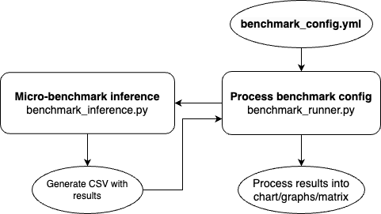

# Microbenchmarks

This directory contains microbenchmarking tools for measuring inference performance across different quantization methods and model architectures.

## Overview

The microbenchmarking system works as follows:


## Components



- **benchmark_runner.py**: Main entry point that orchestrates the benchmarking process
- **benchmark_inference.py**: Handles model creation and inference benchmarking
- **utils.py**: Contains utility functions and configuration classes
- **test\/**: Test files and sample configurations

## Usage

1. Create a configuration YAML file (see example below)
2. Run the benchmark using:

```bash
python -m benchmarks.microbenchmarks.benchmark_runner --config path/to/config.yml
```

### Example Configuration

```yaml
# Sample configuration for inference benchmarks
quantization_config_recipe_names:
  - "baseline"
  - "int8wo"
  - "int4wo-128"
  - "int4wo-128-hqq"

output_dir: "benchmarks/microbenchmarks/results"

model_params:
  matrix_shapes:
    - name: "custom"
      shapes: [
        [1024, 1024, 1024],  # [m, k, n]
        [2048, 4096, 1024],
        [4096, 4096, 1024]
      ]
  high_precision_dtype: "torch.bfloat16"
  compile: "max-autotune" # Options: "default", "max-autotune", "false"
  device: "cuda"  # Options: "cuda", "mps", "xpu", "cpu"
  model_type: "linear"  # Options: "linear", "ln_linear_sigmoid"
```

## Configuration Options

### Quantization Methods
- `baseline`: No quantization
- `int8wo`: 8-bit weight-only quantization
- `int4wo-{group_size}`: 4-bit weight-only quantization with specified group size
- `int4wo-{group_size}-hqq`: 4-bit weight-only quantization with HQQ

### Model Types
- `linear`: Simple linear layer
- `ln_linear_sigmoid`: LayerNorm + Linear + Sigmoid

### Device Options
- `cuda`: NVIDIA GPU
- `xpu`: Intel GPU
- `mps`: Apple Silicon GPU
- `cpu`: CPU fallback

## Output

Results are saved to a CSV file in the specified output directory

## Running Tests

To run the test suite:

```bash
python -m unittest discover benchmarks/microbenchmarks/test
```
